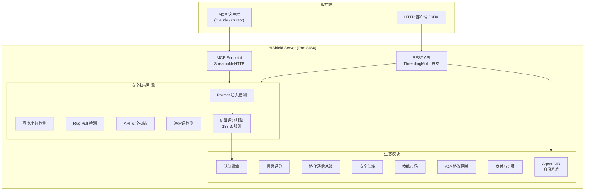

<h1 align="center">AIShield</h1>

<p align="center">
  <strong>AI Agent 安全生态基础设施</strong><br>
  <sub>让任何 Agent 可以安全地发现、验证、委托、支付另一个 Agent</sub>
</p>

<p align="center">
  <a href="https://github.com/lm203688/aishield/blob/main/LICENSE"></a>
  <a href="https://www.python.org/downloads/"></a>
  <a href="https://owasp.org/www-project-mcp-security-top-10/"></a>
  
  
  
</p>

```
   ██████╗██╗   ██╗██████╗ ███████╗██████╗ ███████╗███████╗ ██████╗
  ██╔════╝╚██╗ ██╔╝██╔══██╗██╔════╝██╔══██╗██╔════╝██╔════╝██╔════╝
  ██║      ╚████╔╝ ██████╔╝█████╗  ██████╔╝███████╗█████╗  ██║
  ██║       ╚██╔╝  ██╔══██╗██╔══╝  ██╔══██╗╚════██║██╔══╝  ██║
  ╚██████╗   ██║   ██████╔╝███████╗██║  ██║███████║███████╗╚██████╗
   ╚═════╝   ╚═╝   ╚═════╝ ╚══════╝╚═╝  ╚═╝╚══════╝╚══════╝ ╚═════╝
              Security · Identity · Collaboration · Trust
```

---

## 核心特性

🛡️ **133 条安全扫描规则** — 对齐 OWASP MCP Top 10 (2025 v0.1)，覆盖 Prompt 注入、越权访问、数据泄露、协议攻击、供应链风险 5 大安全维度

🧠 **智能 Prompt 注入检测** — 原生支持中文检测，识别拼音变体、谐音替换、拆字攻击等本土化绕过手法

🪪 **Agent 身份系统** — DID 去中心化身份生成、多级信誉评分、API Key 生命周期管理、完整审计日志链

🤝 **Agent 协作通信** — 内置发布/订阅消息总线、协作会话管理、跨 Agent 任务委托，让 Agent 之间安全对话

📦 **安全沙箱执行** — 代码预检查拦截危险模式，支持 Python / JavaScript / Shell 多语言隔离执行，结果自动安全审查

🏪 **技能市场** — 技能发布、搜索与调用一体化，内置评分系统，支持 HTTP RPC 真实调用验证

🔗 **A2A 协议网关** — 兼容 Google A2A 协议，Agent Card 注册与发现，智能任务路由与跨 Agent 调度

💳 **支付与计费** — API 按量计费、套餐管理、使用量统计，为 Agent 经济提供基础设施

🏆 **安全认证徽章** — 扫描通过自动签发认证，生成可嵌入 GitHub README 的 SVG 徽章，金 / 银 / 铜三级

---

## 为什么选择 AIShield

| | AIShield | 纯扫描工具 | 闭源商业方案 | 无交易的平台 |
|:---|:---:|:---:|:---:|:---:|
| 开源透明 | **MIT 全开源** | 部分开源 | ❌ 黑盒 | 部分开源 |
| 安全规则覆盖 | **133 条 (OWASP 对齐)** | 10-60 条 | 依赖厂商 | 有限 |
| 中文 Prompt 检测 | **6 平台违禁词覆盖** | ❌ | 依赖厂商 | ❌ |
| Agent 身份与信任 | **DID + 信誉 + 徽章** | ❌ | 商业附加 | ❌ |
| Agent 协作与市场 | **完整生态** | ❌ | 有限 | 简单注册 |
| 计费与经济模型 | **内置支持** | ❌ | 企业版 | ❌ |
| 外部依赖 | **零依赖** | 有依赖 | N/A | 有依赖 |
| MCP 集成 | **原生支持** | 部分支持 | 有限 | 部分支持 |

> AIShield 不只是一个扫描器 — 它是 AI Agent 安全生态的完整基础设施。

---

## 快速开始

### 1. 克隆并启动

```bash
git clone https://github.com/lm203688/aishield.git
cd aishield
python api/server.py
```

服务启动后访问 **http://localhost:8450**，即可看到 API 信息面板。

### 2. 首次安全扫描

```bash
curl -X POST http://localhost:8450/api/v1/audit \
  -H "Content-Type: application/json" \
  -d '{
    "tool_name": "my-agent-tool",
    "description": "A tool that executes user-provided code",
    "input_schema": {"type": "object", "properties": {"code": {"type": "string"}}},
    "endpoint": "https://example.com/api/tool"
  }'
```

### 3. 获取安全徽章

扫描通过后，在项目 README 中嵌入你的安全徽章：

```markdown

```

部署后替换 `localhost:8450` 为你的公网地址即可在 GitHub 中展示。

---

## MCP 集成

AIShield 可作为 MCP Server 直接集成到 Claude Desktop、Cursor 等支持 MCP 的客户端中。

### Claude Desktop

在 Claude Desktop 配置文件中添加：

```json
{
  "mcpServers": {
    "aishield": {
      "command": "python",
      "args": ["-m", "api.mcp_server"],
      "cwd": "/path/to/aishield"
    }
  }
}
```

### Cursor / 其他 MCP 客户端

同样在 MCP 配置中添加以上内容，即可在对话中直接调用 AIShield 的全部安全扫描能力。

集成后你可以直接在对话中说：

> "帮我扫描这个 MCP 工具是否存在 Prompt 注入风险"

> "检查这段文本是否包含违禁词"

---

## API 文档

服务启动后访问 `http://localhost:8450` 获取完整 API 信息。核心端点包括：

### 安全扫描

| 方法 | 端点 | 描述 |
|:---|:---|:---|
| `POST` | `/api/v1/audit` | 完整安全扫描（含 5 维评分） |
| `POST` | `/api/v1/prompt-check` | Prompt 注入检测 |
| `POST` | `/api/v1/banned-words` | 违禁词检测（6 平台） |
| `POST` | `/api/v1/scan/api` | OpenAPI / Swagger 安全扫描 |
| `GET` | `/api/v1/health` | 服务健康检查 |
| `GET` | `/api/v1/stats` | 扫描统计数据 |

### Agent 生态

| 方法 | 端点 | 描述 |
|:---|:---|:---|
| `GET` | `/api/v1/identity/agents` | Agent 列表 |
| `POST` | `/api/v1/collab/publish` | 发布协作消息 |
| `POST` | `/api/v1/skills/publish` | 发布技能 |
| `POST` | `/api/v1/sandbox/execute` | 沙箱安全执行 |
| `GET` | `/api/v1/proxy/tools` | 可代理工具列表 |
| `POST` | `/api/v1/proxy/call` | 代理调用认证工具 |

---

## 项目架构



**技术特点：**

- **零依赖架构** — 纯 Python 标准库实现，无需 pip install 任何第三方包
- **ThreadingMixIn 并发** — 内置线程池处理，支持多请求并行
- **JSON 文件存储** — 轻量持久化，线程安全，开箱即用
- **OWASP API Security 映射** — 9 大安全类别全覆盖
- **中文违禁词引擎** — 覆盖微信、抖音、小红书、B 站、微博 6 大平台

---

## 安全认证徽章

AIShield 为通过安全扫描的工具自动签发可嵌入的 SVG 徽章，让你的项目安全状态一目了然。

### 徽章等级

| 等级 | 条件 | 徽章样式 |
|:---|:---|:---|
| 🥇 Gold | 总分 >= 90 | 金色边框 + 盾牌 |
| 🥈 Silver | 总分 >= 70 | 银色边框 + 盾牌 |
| 🥉 Bronze | 总分 >= 50 | 铜色边框 + 盾牌 |

### 在你的项目中使用

在你的 `README.md` 中添加以下代码：

```markdown
<!-- AIShield Security Badge -->

```

AIShield 会根据最新扫描结果动态渲染徽章颜色和状态。

---

## 路线图

### Phase 1 — 安全扫描引擎 ✅ (当前)

- [x] 133 条 OWASP MCP Top 10 对齐检测规则
- [x] 5 维安全评分引擎
- [x] 中文 Prompt 注入检测（拼音 / 谐音 / 拆字）
- [x] 零宽字符 / 隐写术 / Rug Pull 检测
- [x] 违禁词检测（6 大中文平台）
- [x] MCP Server 模式 + StreamableHTTP
- [x] 代理调用网关

### Phase 2 — 信任生态

- [ ] Agent DID 身份注册与跨链验证
- [ ] 多级信誉系统上线
- [ ] 安全徽章签发平台
- [ ] 技能市场 Beta
- [ ] A2A 协议网关完善
- [ ] 按量计费与配额管理

### Phase 3 — 规模化治理

- [ ] 多租户支持与企业 SSO
- [ ] 社区贡献规则市场
- [ ] AI 驱动的规则自动生成
- [ ] Web Dashboard 可视化管理
- [ ] 国际化 (i18n) 多语言支持
- [ ] SLA 监控与告警

---

## 贡献指南

我们欢迎任何形式的贡献，包括但不限于：新检测规则、Bug 修复、文档改进、功能建议。

### 参与步骤

1. **Fork** 本仓库
2. 创建特性分支：`git checkout -b feature/your-feature-name`
3. 提交变更：`git commit -m 'feat: add xxx feature'`
4. 推送分支：`git push origin feature/your-feature-name`
5. 提交 **Pull Request**

### 提交规范

使用 [Conventional Commits](https://www.conventionalcommits.org/) 格式：

- `feat:` 新功能
- `fix:` Bug 修复
- `docs:` 文档变更
- `refactor:` 代码重构
- `test:` 测试相关
- `chore:` 构建 / 工具链变更

### 贡献检测规则

在 `scanner/rules.py` 中添加新规则，确保与 OWASP MCP Top 10 分类对齐。提交 PR 前运行测试：

```bash
python tests/quick_test.py
```

---

## 部署

AIShield 支持多种部署方式：

**直接运行：**

```bash
python api/server.py
```

**Docker：**

```bash
docker build -t aishield .
docker run -p 8450:8450 aishield
```

**Railway / Render：**

项目内置 `railway.json`、`render.yaml` 和 `Procfile`，可直接一键部署。

详见 [DEPLOY.md](./DEPLOY.md)。

---

## 致谢

- [OWASP MCP Security Top 10](https://owasp.org/www-project-mcp-security-top-10/) — 安全标准与规则体系
- [Google A2A Protocol](https://github.com/google/A2A) — Agent-to-Agent 通信协议参考
- [MCP Community](https://modelcontextprotocol.io/) — Model Context Protocol 社区生态
- 所有为 AIShield 贡献代码和规则的 [Contributors](https://github.com/lm203688/aishield/graphs/contributors)

---

## 许可证

[MIT License](./LICENSE) © 2025 AIShield Contributors