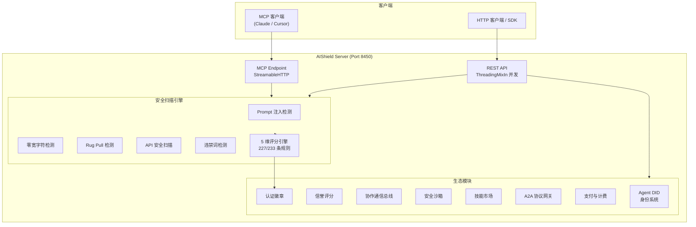

<h1 align="center">AIShield</h1>

<p align="center">
  <strong>AI Agent 安全生态基础设施</strong><br>
  <sub>让任何 Agent 可以安全地发现、验证、委托、支付另一个 Agent</sub>
</p>

<p align="center">
  <a href="https://github.com/lm203688/aishield/blob/main/LICENSE"></a>
  <a href="https://www.python.org/downloads/"></a>
  <a href="https://owasp.org/www-project-mcp-security-top-10/"></a>
  
  
  
</p>

<p align="center">
  <a href="https://aishield.tools/pricing"><strong>🚀 免费注册 — 送 100 积分体验金</strong></a>
</p>

```
   ██████╗██╗   ██╗██████╗ ███████╗██████╗ ███████╗███████╗ ██████╗
  ██╔════╝╚██╗ ██╔╝██╔══██╗██╔════╝██╔══██╗██╔════╝██╔════╝██╔════╝
  ██║      ╚████╔╝ ██████╔╝█████╗  ██████╔╝███████╗█████╗  ██║
  ██║       ╚██╔╝  ██╔══██╗██╔══╝  ██╔══██╗╚════██║██╔══╝  ██║
  ╚██████╗   ██║   ██████╔╝███████╗██║  ██║███████║███████╗╚██████╗
   ╚═════╝   ╚═╝   ╚═════╝ ╚══════╝╚═╝  ╚═╝╚══════╝╚══════╝ ╚═════╝
              Security · Identity · Collaboration · Trust
```

---

## 核心特性

🛡️ **227 条 MCP 规则 / 233 条 Skill 规则** — 对齐 OWASP MCP Top 10 (2025 v0.1) 与 OWASP Agentic AI Top 10 (ASI01–ASI10)，覆盖 Prompt 注入、越权访问、数据泄露、协议攻击、供应链风险、沙箱逃逸 6 大维度

🧰 **Agent 计算机的内容安全平面** — Cloudflare Sandboxes、forgevm、E2B、Open Interpreter、Goose 这类运行时管的是**爆炸半径**（agent 能碰到什么），AIShield 管的是**内容可信**（agent 读进来的 MCP server、skill、工具描述该不该信）。两者互补：启动前工作区预扫 → 沙箱硬化规则 → 每次调用准入 → 持续鉴证。详见 [Agent 计算机的两个安全平面](docs/agent-computer-security-plane.md)

📄 **Markdown 按可执行体扫描** — 对 Skill 类资产，`SKILL.md` 本身就是程序。把 `.md` 一律当「文档示例」降级的扫描器，会整条漏掉 skill 供应链

🧠 **智能 Prompt 注入检测** — 原生支持中文检测，识别拼音变体、谐音替换、拆字攻击等本土化绕过手法

🪪 **Agent 身份系统** — DID 去中心化身份生成、多级信誉评分、API Key 生命周期管理、完整审计日志链

🤝 **Agent 协作通信** — 内置发布/订阅消息总线、协作会话管理、跨 Agent 任务委托，让 Agent 之间安全对话

📦 **安全沙箱执行** — 代码预检查拦截危险模式，支持 Python / JavaScript / Shell 多语言隔离执行，结果自动安全审查

🏪 **技能市场** — 技能发布、搜索与调用一体化，内置评分系统，支持 HTTP RPC 真实调用验证

🔗 **A2A 协议网关** — 兼容 Google A2A 协议，Agent Card 注册与发现，智能任务路由与跨 Agent 调度

💳 **支付与计费** — API 按量计费、套餐管理、使用量统计，为 Agent 经济提供基础设施

🏆 **安全认证徽章** — 扫描通过自动签发认证，生成可嵌入 GitHub README 的 SVG 徽章，金 / 银 / 铜三级

🌐 **中立信任机构（Neutral Trust Authority）** — AIShield 不只是扫描器，更是 agent 生态的**信任层**：每个被扫资产都拿到一张机器可读、可签名、可嵌入发现格式的 [Trust Attestation（`aishield-trust/v1`）](docs/trust-attestation-spec.md) 凭证。MCP Server Card / A2A Agent Card / Google `ai-catalog` 只需在自己的 metadata 里加一个 `trust` 字段，就能零成本引用 AIShield 的「内容是否可信」裁决——而这一层目前是整条 agent 供应链最薄弱、也最被抢位的空白。AIShield 的差异化锚点：**唯一本地离线、扫内容（prompt 注入 / 工具中毒 / 供应链漂移）、绝不执行被扫配置**的信任裁决。生态占位策划见 [docs/ecosystem-positioning-2026.md](docs/ecosystem-positioning-2026.md)。

---

## 为什么选择 AIShield

| | AIShield | 纯扫描工具 | 闭源商业方案 | 无交易的平台 |
|:---|:---:|:---:|:---:|:---:|
| 开源透明 | **MIT 全开源** | 部分开源 | ❌ 黑盒 | 部分开源 |
| 安全规则覆盖 | **227 / 233 条 (OWASP 双维对齐)** | 10-60 条 | 依赖厂商 | 有限 |
| 中文 Prompt 检测 | **6 平台违禁词覆盖** | ❌ | 依赖厂商 | ❌ |
| Agent 身份与信任 | **DID + 信誉 + 徽章** | ❌ | 商业附加 | ❌ |
| Agent 身份 / 网络层扫描 | **扫身份缺陷 + 组网过宽** | ❌ | 有限 | ❌ |
| Agent 协作与市场 | **完整生态** | ❌ | 有限 | 简单注册 |
| 计费与经济模型 | **内置支持** | ❌ | 企业版 | ❌ |
| 外部依赖 | **零依赖** | 有依赖 | N/A | 有依赖 |
| MCP 集成 | **原生支持** | 部分支持 | 有限 | 部分支持 |

🔍 **Agent 身份与凭证扫描（身份层 / NHI）** — 2026 年 agent 安全的主战场已从「工具执行」转移到「agent 身份可验证」（A2A 仓库 top issue 全在身份；Authentik 借 NHI 重燃；ANS/DNSid/Entra Agent ID 扎堆）。AIShield 从「只发信任证书」升级为「也扫身份缺陷」：AgentCard/agent 身份是否签名、凭证是否短期过期、授权是否过宽（`scope: "*"` 违反最小权限）、是否缺 mTLS/DID、委托是否做 scope attenuation。详见 [Agent 生态 2026 态势与卡位](docs/agent-ecosystem-2026-landscape.md)。

🕸️ **Agent 网络 / Mesh 配置扫描（网络层）** — Cloudflare Mesh 把 agent 组网做成基础设施，却官方自认「缺 per-agent 身份与策略」（所有 agent 流量被当成来自一个 Worker）。AIShield 补这个缺口：扫描整账户 Mesh/VPC 绑定是否把全网暴露给所有 agent、agent 端点是否无鉴权（`auth: none`）、私有资源是否公网暴露（`public: true`）。内容可信 + 身份归因 + 组网可达性，三管齐下覆盖 agent 的「信任浅滩」。

🔐 **Authentik / NHI service-account 扫描（身份层 · Authentik 流派）** — 扫描 Authentik 风格的 service-account 导出：`skip_authorization` 跳同意、令牌永不过期（`token_ttl: 0/never`）、scope 过宽（`"*"`）、硬编码 `client_secret`。把身份层从「只发证书」扩展到「也扫 NHI 卫生」。

🪪 **A2A AgentCard 结构化校验（身份层 · A2A 流派）** — 对 `.well-known/agent.json` 做 JSON 结构化校验：未签名、缺过期、非 https、无鉴权方案（`securitySchemes`）、委托链未做 scope attenuation。直接对应 A2A #1672/#1628 的「信任浅滩」。

🛡️ **AI-slop / 越狱规避检测（内容可信层）** — 识别专为绕过内容分类器而设计的 prompt/skill：指令覆盖（ignore previous instructions）、DAN 角色扮演、base64/翻译混淆、反检测自指。这是「去 AI 味」文化浪潮被武器化的一面，AIShield 做其安全/可信对冲层（与 soundshuman 风格层互补非竞品）。

💰 **AP2 / x402 支付授权 scope 审计（经济层 · 支付授权）** — 扫描 agent 支付配置：`maxAmount` 无限、`auto_approve` 免确认、支付 scope 过宽、支付授权未绑 intent（cartId/orderId）。覆盖 agent 经济层的「三授权」收敛。

🧩 **OWASP Agentic AI Top 10（ASI01–ASI10）全覆盖 — 11 个新模块补完「3 个全空白 + 5 个半覆盖」域：**
- **ASI01 目标劫持**（`scanner/goal_hijack_scan.py`）：把外部内容当指令、目标替换、持久/永久目标注入。
- **ASI02 工具滥用 / 最小权限**（`scanner/least_agency_scan.py`）：管道到 shell、`rm -rf`、`sudo`、`chmod 777`、`os.system`/`eval`、凭证与 SSH key 读取。
- **ASI03 身份 / OAuth 姿态**（`scanner/mcp_oauth_scan.py`）：无认证的远程 MCP server（CVE-2026-32211 类）、缺 RFC 9207 issuer 的 OAuth、长寿命/不轮换 token。（GPT Action 清单按自身 `auth` schema 识别，不误报为 MCP 缺口。）
- **ASI04 供应链 / 来源可信**（`scanner/provenance_scan.py`）：`npx`/`pip` 未 pin 版本、git 安装未 pin commit、锁定文件缺完整性、SBOM 未签名。
- **ASI06 记忆 / 上下文投毒**（`scanner/memory_scan.py`）：写入记忆的指令、持久/种子目标、记忆文件写入。
- **ASI07 跨 agent / 委托**（`scanner/scope_composition_scan.py`）：用 agent 自身凭证转发请求的混淆副手（confused deputy）。
- **ASI08 级联失败 / 爆炸半径**（`scanner/scope_composition_scan.py`）：凭证读取 + 外传组合（所有已连接 server scope 的并集）。
- **ASI09 人机信任利用**（`scanner/dark_pattern_scan.py`）：权威冒充、压制核验、虚假保证、紧迫感——需 ≥2 个信号同时命中才报警（低误报）。
- **ASI10 失控 agent / 反篡改**（`scanner/antitamper_scan.py`）：自保护/删除后重装、禁用/替换其它组件、反分析/隐藏指令。
- **工具 / 技能完整性**（`scanner/tool_integrity_scan.py`）：工具名 typosquat（与规范品牌编辑距离 ≤2，CVE-2026-30856 类）、未 pin 版本的远程 MCP（rug-pull）。
- **注册中心供应链**（`scanner/registry_supply_scan.py`）：技能名 typosquat、可疑外传、渐进式隐藏载荷（主文件把安装命令延迟到次级 `.md`）。

上述 11 个模块全部通过 `tests/test_capability_full_scan.py` 的「良性零误报 + 恶意仍被拦」契约（40 项）；全量测试 **523 通过 / 0 失败 / 9 跳过**。

> AIShield 不只是一个扫描器 — 它是 AI Agent 安全生态的完整基础设施。

---

## 快速开始

### 1. 克隆并启动

```bash
git clone https://github.com/lm203688/aishield.git
cd aishield
python api/server.py
```

服务启动后访问 **http://localhost:8450**，即可看到 API 信息面板。

### 2. 注册获取 API Key（送 100 积分）

```bash
curl -X POST https://aishield.tools/api/v1/account/register \
  -H "Content-Type: application/json" \
  -d '{
    "name": "Your Name",
    "email": "your@email.com",
    "password": "YourSecurePassword123"
  }'
```

注册成功返回 `api_key`，后续调用需要携带 `Authorization: Bearer YOUR_API_KEY`。

### 3. 首次安全扫描

```bash
curl -X POST https://aishield.tools/api/v1/audit \
  -H "Authorization: Bearer YOUR_API_KEY" \
  -H "Content-Type: application/json" \
  -d '{
    "tool_name": "my-agent-tool",
    "description": "A tool that executes user-provided code",
    "input_schema": {"type": "object", "properties": {"code": {"type": "string"}}},
    "endpoint": "https://example.com/api/tool"
  }'
```

> 💡 未注册用户也可匿名免费扫描 **50 次/天**，注册后获 **100 积分**（可扫描 100 次），[查看定价](https://aishield.tools/pricing)。

### 4. 获取安全徽章

扫描通过后，在项目 README 中嵌入你的安全徽章：

```markdown

```

部署后替换 `localhost:8450` 为你的公网地址即可在 GitHub 中展示。

---

## MCP 集成

AIShield 可作为 MCP Server 直接集成到 Claude Desktop、Cursor 等支持 MCP 的客户端中。

### Claude Desktop

在 Claude Desktop 配置文件中添加：

```json
{
  "mcpServers": {
    "aishield": {
      "command": "python",
      "args": ["-m", "api.mcp_server"],
      "cwd": "/path/to/aishield"
    }
  }
}
```

### Cursor / 其他 MCP 客户端

同样在 MCP 配置中添加以上内容，即可在对话中直接调用 AIShield 的全部安全扫描能力。

集成后你可以直接在对话中说：

> "帮我扫描这个 MCP 工具是否存在 Prompt 注入风险"

> "检查这段文本是否包含违禁词"

---

## CI 安全门禁（GitHub Action）

把 AIShield 接入任何仓库的 CI：每次 push / PR 自动扫描工作区里的 MCP server、skill、prompt，**达到阈值即让构建失败**。

```yaml
# .github/workflows/aishield.yml
name: AIShield Security Scan
on: [push, pull_request]
jobs:
  aishield:
    runs-on: ubuntu-latest
    steps:
      - uses: actions/checkout@v4
      - uses: lm203688/aishield@v4.2.2   # 发布到 Marketplace 后可用；此前用 commit/ tag 引用
        with:
          fail_on: high        # safe / medium / high / critical
          tool_type: mcp       # mcp / skill / gpt / prompt
      - name: 上传 SARIF 到 GitHub Security
        if: always()
        uses: github/codeql-action/upload-sarif@v3
        with:
          sarif_file: aishield.sarif
```

差异化：默认 **no-spawn（不执行被扫配置）** + 内容/prompt 注入检测 + **中文合规（违禁词）**——占「中国合规 + 不执行」位，与 AgentAuditKit 的通用位互补。

---

## API 文档

服务启动后访问 `http://localhost:8450` 获取完整 API 信息。核心端点包括：

### 安全扫描

| 方法 | 端点 | 描述 |
|:---|:---|:---|
| `POST` | `/api/v1/audit` | 完整安全扫描（含 5 维评分） |
| `POST` | `/api/v1/prompt-check` | Prompt 注入检测 |
| `POST` | `/api/v1/banned-words` | 违禁词检测（6 平台） |
| `POST` | `/api/v1/scan/api` | OpenAPI / Swagger 安全扫描 |
| `GET` | `/api/v1/health` | 服务健康检查 |
| `GET` | `/api/v1/stats` | 扫描统计数据 |

### Agent 生态

| 方法 | 端点 | 描述 |
|:---|:---|:---|
| `GET` | `/api/v1/identity/agents` | Agent 列表 |
| `POST` | `/api/v1/collab/publish` | 发布协作消息 |
| `POST` | `/api/v1/skills/publish` | 发布技能 |
| `POST` | `/api/v1/sandbox/execute` | 沙箱安全执行 |
| `GET` | `/api/v1/proxy/tools` | 可代理工具列表 |
| `POST` | `/api/v1/proxy/call` | 代理调用认证工具 |

---

## 项目架构


```mermaid
graph TB
    subgraph Clients["客户端"]
        MCP["MCP 客户端<br/>(Claude / Cursor)"]
        SDK["HTTP 客户端 / SDK"]
    end

    subgraph Server["AIShield Server (Port 8450)"]
        API["REST API<br/>ThreadingMixIn 并发"]
        MCPE["MCP Endpoint<br/>StreamableHTTP"]

        subgraph Scanner["安全扫描引擎"]
            PE["Prompt 注入检测"]
            MW["零宽字符检测"]
            RP["Rug Pull 检测"]
            AS["API 安全扫描"]
            BW["违禁词检测"]
            SC["5 维评分引擎<br/>227/233 条规则"]
        end

        subgraph Eco["生态模块"]
            ID["Agent DID<br/>身份系统"]
            RP2["信誉评分"]
            CO["协作通信总线"]
            SB["安全沙箱"]
            MK["技能市场"]
            A2A["A2A 协议网关"]
            PAY["支付与计费"]
            BD["认证徽章"]
        end
    end

    MCP --> MCPE
    SDK --> API
    MCPE --> Scanner
    API --> Scanner
    API --> Eco
    Scanner --> SC
    SC --> BD
```

**技术特点：**

- **零依赖架构** — 纯 Python 标准库实现，无需 pip install 任何第三方包
- **ThreadingMixIn 并发** — 内置线程池处理，支持多请求并行
- **JSON 文件存储** — 轻量持久化，线程安全，开箱即用
- **OWASP API Security 映射** — 9 大安全类别全覆盖
- **中文违禁词引擎** — 覆盖微信、抖音、小红书、B 站、微博 6 大平台

---

## 安全认证徽章

AIShield 为通过安全扫描的工具自动签发可嵌入的 SVG 徽章，让你的项目安全状态一目了然。

### 徽章等级

| 等级 | 条件 | 徽章样式 |
|:---|:---|:---|
| 🥇 Gold | 总分 >= 90 | 金色边框 + 盾牌 |
| 🥈 Silver | 总分 >= 70 | 银色边框 + 盾牌 |
| 🥉 Bronze | 总分 >= 50 | 铜色边框 + 盾牌 |

### 在你的项目中使用

在你的 `README.md` 中添加以下代码：

```markdown
<!-- AIShield Security Badge -->

```

AIShield 会根据最新扫描结果动态渲染徽章颜色和状态。

---

## 路线图

### Phase 1 — 安全扫描引擎 ✅ (当前)

- [x] 227 MCP / 233 Skill 条 OWASP MCP Top 10 + Agentic ASI01–10 对齐检测规则
- [x] 5 维安全评分引擎
- [x] 中文 Prompt 注入检测（拼音 / 谐音 / 拆字）
- [x] 零宽字符 / 隐写术 / Rug Pull 检测
- [x] 违禁词检测（6 大中文平台）
- [x] MCP Server 模式 + StreamableHTTP
- [x] 代理调用网关

### Phase 2 — 信任生态

- [ ] Agent DID 身份注册与跨链验证
- [ ] 多级信誉系统上线
- [ ] 安全徽章签发平台
- [ ] 技能市场 Beta
- [ ] A2A 协议网关完善
- [ ] 按量计费与配额管理

### Phase 3 — 规模化治理

- [ ] 多租户支持与企业 SSO
- [ ] 社区贡献规则市场
- [ ] AI 驱动的规则自动生成
- [ ] Web Dashboard 可视化管理
- [ ] 国际化 (i18n) 多语言支持
- [ ] SLA 监控与告警

---

## 贡献指南

我们欢迎任何形式的贡献，包括但不限于：新检测规则、Bug 修复、文档改进、功能建议。

### 参与步骤

1. **Fork** 本仓库
2. 创建特性分支：`git checkout -b feature/your-feature-name`
3. 提交变更：`git commit -m 'feat: add xxx feature'`
4. 推送分支：`git push origin feature/your-feature-name`
5. 提交 **Pull Request**

### 提交规范

使用 [Conventional Commits](https://www.conventionalcommits.org/) 格式：

- `feat:` 新功能
- `fix:` Bug 修复
- `docs:` 文档变更
- `refactor:` 代码重构
- `test:` 测试相关
- `chore:` 构建 / 工具链变更

### 贡献检测规则

在 `scanner/rules.py` 中添加新规则，确保与 OWASP MCP Top 10 分类对齐。提交 PR 前运行测试：

```bash
python tests/quick_test.py
```

---

## 部署

AIShield 支持多种部署方式：

**直接运行：**

```bash
python api/server.py
```

**Docker：**

```bash
docker build -t aishield .
docker run -p 8450:8450 aishield
```

**Railway / Render：**

项目内置 `railway.json`、`render.yaml` 和 `Procfile`，可直接一键部署。

详见 [DEPLOY.md](./DEPLOY.md)。

---

## 🚀 立即开始

选择最适合你的方式开始使用 AIShield：

| 方式 | 操作 | 适合场景 |
|:---|:---|:---|
| **在线体验** | 访问 [aishield.tools](https://aishield.tools) 直接扫描 | 快速体验，无需部署 |
| **本地运行** | `git clone` + `python api/server.py` | 开发调试，自定义规则 |
| **MCP 集成** | 配置 Claude Desktop / Cursor | 在对话中直接扫描 |
| **API 调用** | 注册获取 API Key，集成到 CI/CD | 自动化安全审计 |

<p align="center">
  <a href="https://aishield.tools/pricing"><strong>免费注册 — 获取 100 积分体验金 →</strong></a>
</p>

---

## 致谢

- [OWASP MCP Security Top 10](https://owasp.org/www-project-mcp-security-top-10/) — 安全标准与规则体系
- [Google A2A Protocol](https://github.com/google/A2A) — Agent-to-Agent 通信协议参考
- [MCP Community](https://modelcontextprotocol.io/) — Model Context Protocol 社区生态
- 所有为 AIShield 贡献代码和规则的 [Contributors](https://github.com/lm203688/aishield/graphs/contributors)

---

## 许可证

[MIT License](./LICENSE) © 2025 AIShield Contributors

<!--LATEST_POSTS_START-->

### 📰 最新安全洞察

- [MCP 2026-07-28 无状态化：安全网关必须回答的 3 个问题](https://lm203688.github.io/aishield/blog/blog-mcp-stateless-security-2026-08-03.html) `2026-08-03`
- [从 HuggingFace 被入侵看 Agent 沙箱逃逸的 4 个必要条件](https://lm203688.github.io/aishield/blog/blog-sandbox-escape-2026-08-03.html) `2026-08-03`
- [深入分析：filesystem-test 如何修复安全漏洞](https://lm203688.github.io/aishield/blog/case-filesystem-test-2026-07-25.html) `2026-07-25`
- [MCP 安全扫描周报 #30：发现 0 个高危风险](https://lm203688.github.io/aishield/blog/weekly-2026-07-25.html) `2026-07-25`

<!--LATEST_POSTS_END-->
